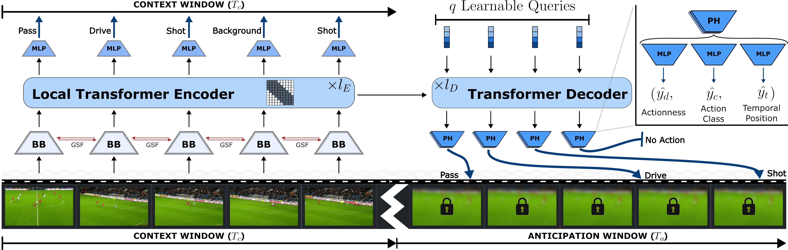

# FAANTRA
Source code for the Football Action ANticipation Transformer (FAANTRA) for action anticipation in football broadcast videos. This repository contains the training and evaluation code used in the "Anticipation from SoccerNet Football Video Broadcasts" paper.



## Abstract
Artificial intelligence has revolutionized the way we analyze sports videos, whether to understand the actions of games in long untrimmed videos or to anticipate the player's motion in future frames.
Despite these efforts, little attention has been given to anticipating game actions before they occur.
In this work, we introduce the task of action anticipation for football broadcast videos, which consists in predicting future actions in unobserved future frames, within a five- or ten-second anticipation window.
To benchmark this task, we release a new dataset, namely the SoccerNet Ball Action Anticipation dataset, based on SoccerNet Ball Action Spotting. 
Additionally, we propose a Football Action ANticipation TRAnsformer (FAANTRA), a baseline method that adapts FUTR, a state-of-the-art action anticipation model, to predict ball-related actions.
To evaluate action anticipation, we introduce new metrics, including mAP@$\delta$, which evaluates the temporal precision of predicted future actions, as well as mAP@$\infty$, which evaluates their occurrence within the anticipation window. We also conduct extensive ablation studies to examine the impact of various task settings, input configurations, and model architectures. 
Experimental results highlight both the feasibility and challenges of action anticipation in football videos, providing valuable insights into the design of predictive models for sports analytics. 
By forecasting actions before they unfold, our work will enable applications in automated broadcasting, tactical analysis, and player decision-making. 
Our dataset and code are publicly available at [https://github.com/MohamadDalal/FAANTRA](https://github.com/MohamadDalal/FAANTRA)

# Dataset

The Ball Action Anticipation (BAA) dataset can be found at [https://huggingface.co/datasets/SoccerNet/ActionAnticipation/tree/main](https://huggingface.co/datasets/SoccerNet/ActionAnticipation/tree/main). The password for the zip files is the same password used to download the SoccerNet datasets, and can be acquired by signing the NDA at [https://www.soccer-net.org/data](https://www.soccer-net.org/data).

# Setup

## Environment
Using venv (virtual environment):
- Create the environment using ```python -m venv venv```
- Activate the environment using ```source venv/bin/activate``` on Linux/Mac or ```./venv/Scripts/Activate``` on Windows.
- Once in the environment use ```pip install -r requirements.txt``` to install all the necessary packages

For reference purposes, the version of the necessary packages when the code was last tested will be provided:
- numpy: 1.26.4
- scipy: 1.15.3
- torch: 2.8.0a0+5228986c39.nv25.6 (from this [NGC container](https://catalog.ngc.nvidia.com/orgs/nvidia/containers/pytorch?version=25.06-py3))
- einops: 0.8.1
- timm: 1.0.19
- SoccerNet: 0.1.62
- wandb: 0.21.1
- tabulate: 0.9.0
- pyzipper: 0.3.6

The code was last tested (fully trained) on 27/08/2025

## Dataset

This repository can use two different datasets. It can use the SoccerNet v2 Ball Action Spotting-2024 (BAS) dataset, which is split into clips in the code, or it can use the novel Soccernet Ball Action Anticipation (BAA) dataset, which is pre-split into clips.

If your purpose is to fully reproduce the published paper, then train and evaluate on the BAS dataset, as it was the one used for training and evaluating the paper results. Otherwise feel free to use any of the datasets for training and evaluation. However, if you want to participate in the SoccerNet Ball Action Anticipation challenge, then you have to evaluate on the test and challenge splits from the BAA dataset, in order to get submittable results.

### BAA

The BAA dataset can be downloaded using the huggingface_hub package. The setup_dataset_BAA.py script is provided to download the videos and extract the frames. To download the BAA videos, an NDA form from the [SoccerNet website](https://www.soccer-net.org/data) needs to be signed to get the download password. 

Notes: Exporting the frames from the videos requires ffmpeg to be installed on your system or container.

The script is run using the following command:
```
python setup_dataset_BAA.py --download-key {NDA key}
```
Optional arguments can be passed to change download path or only run the download part or frame extraction part of the script. Use 
```
python setup_dataset_BAA.py --help
```
To list all arguments. It is recommended to check the extra arguments, as they can be relevant if you do not have enough storage and want to extract low resolution frames for example.

### BAS

The BAS dataset can be downloaded using the SoccerNet package. The setup_dataset_BAS.py script is provided to download the videos and extract the frames. To download the BAS videos, an NDA form from the [SoccerNet website](https://www.soccer-net.org/data) needs to be signed to get the download key. 

Notes: Exporting the frames from the videos requires ffmpeg to be installed on your system or container.

The script is run using the following command:
```
python setup_dataset_BAS.py --download-key {NDA key}
```
Optional arguments can be passed to change download path or only run the download part or frame extraction part of the script. Use 
```
python setup_dataset_BAS.py --help
```
To list all arguments. It is recommended to check the extra arguments, as they can be relevant if you do not have enough storage and want to extract low resolution frames for example.

# Training Model
Training is done using the main.py script:
```
python main.py {config-path} {model-name}
```
All necessary parameters are stored in the json config file, while details of every config option can be found in opts.py or the README inside the configs folder.

While training, a checkpoint is saved every epoch, which contains the necessary variables to continue training from that checkpoint. On the other hand, the model with the best mAP has only its parameters saved in its checkpoint, and cannot be used to continue training.

In order to continue training, the checkpoint path can be provided to main.py as an optional argument:
```
python main.py {config-path} {model-name} --checkpoint-path {checkpoint-path}
```

# Evaluating Model
Models are always evaluated on the test set at the end of training. However, if you want to evaluate a model that is already trained, then you can use:
```
python test.py {config-path} {checkpoint-path} {model-name} -s {split-name}
```
This will test the model using the specified split, print the results out and create a json with model predictions (in case of evaluating using the BAA dataset)

# Producing Inference Example
This script is a work in progress. The plan is to take in an arbitrary set of frames (or video file), split it into observation and anticipation and then use the model to predict actions in the anticipation part. Then a video will be produced to show the results of the model. The video will look something like this:

https://github.com/user-attachments/assets/30acd726-e946-4dc1-9472-62949b038c49


# Citation

If you use this code or our dataset, then please cite using:
```bibtex
@InProceedings{Dalal_2025_CVPR,
    author    = {Dalal, Mohamad and Xarles, Artur and Cioppa, Anthony and Giancola, Silvio and Van Droogenbroeck, Marc and Ghanem, Bernard and Clap\'es, Albert and Escalera, Sergio and Moeslund, Thomas B.},
    title     = {Action Anticipation from SoccerNet Football Video Broadcasts},
    booktitle = {Proceedings of the IEEE/CVF Conference on Computer Vision and Pattern Recognition (CVPR) Workshops},
    month     = {June},
    year      = {2025},
    pages     = {6079-6090}
}
```

# References
This repository is built upon the FUTR and T-Deed repositories, and therefore it is only fair to put them as references:

## FUTR
[Gong, D., Lee, J., Kim, M., Ha, S. J., & Cho, M. (2022). Future transformer for long-term action anticipation. In Proceedings of the IEEE/CVF Conference on Computer Vision and Pattern Recognition (pp. 3052-3061).](https://openaccess.thecvf.com/content/CVPR2022/html/Gong_Future_Transformer_for_Long-Term_Action_Anticipation_CVPR_2022_paper.html)

[Repository](https://github.com/gongda0e/FUTR)

## T-Deed
[Xarles, A., Escalera, S., Moeslund, T. B., & Clapés, A. (2024). T-DEED: Temporal-Discriminability Enhancer Encoder-Decoder for Precise Event Spotting in Sports Videos. In Proceedings of the IEEE/CVF Conference on Computer Vision and Pattern Recognition (pp. 3410-3419).](https://openaccess.thecvf.com/content/CVPR2024W/CVsports/html/Xarles_T-DEED_Temporal-Discriminability_Enhancer_Encoder-Decoder_for_Precise_Event_Spotting_in_Sports_CVPRW_2024_paper.html)

[Repository](https://github.com/arturxe2/T-DEED_v2)
